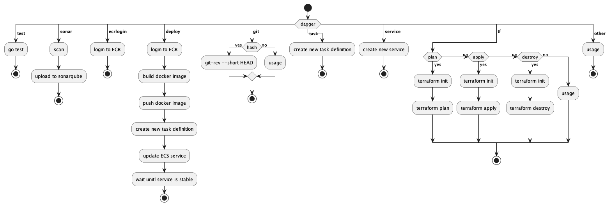

# Dagger CI Tool
This is to demo [Dagger](https://dagger.io/) using the [GO SDK](https://pkg.go.dev/dagger.io/dagger). The goal of this demo is to create an elegant CI tool that will include all tasks normally used in a CI pipeline. In other words, PaC: Pipeline as code. This is possible by using GOand the Dagger GO SDK. Dagger executes your pipelines entirely as standard [OCI containers](https://opencontainers.org/).

## Requirements
* Install [GO](https://go.dev/doc/install)
* Install Docker Desktop or [Colima](https://github.com/abiosoft/colima)
* Install [Docker](https://formulae.brew.sh/formula/docker)
* Run `cd dagger && go build`
* Run `./dagger`

## TODO:
- [X] add github actions
- [X] sonarqube
- [X] add diagram
- [X] add to readme
- [ ] document code

## Diagram of flow

## Main and Tasks GO Packages
There are two packages in this repository, [main](dagger/), and [tasks](dagger/tasks/). Main is used to read the command or tasks that is provided, and provide correct usage of the cli. Tasks has all tasks in separate files. For example all SonarQube tasks are in the `sonarQube.go` file. New tasks can be entered into the Tasks package/directory which could increase in number of tasks over time, while the main package just calls those tasks. Think of having an AWS and Azure task within the same package, and main package can be tailored for any needs for the pipeline.

## Environment Variables
A lot of these tasks require environment variables. These can either be added to an `.env` file. An example can be found in the [dagger directory](dagger/). The variables can also be exported to the cli.

## Tasks

These are the tasks currently used in this demo:

* [test](dagger/tasks/test.go): Will run [go test](https://pkg.go.dev/testing) on the [api](api/) from the [main_test.go](api/main_test.go) file. 
* [sonar](dagger/tasks/sonarQube.go): Will run a Docker container using the Dagger GO SDK, scan the api directory, and publish the results to SonarQube.
* [ecrlogin](dagger/tasks/ecrLogin.go): In order to push the Docker image created, authentication against the AWS ECR will need to be ran. This will use [AWS GO SDK](https://pkg.go.dev/github.com/aws/aws-sdk-go/aws).
* [deploy](dagger/tasks/awsECS.go): Deploy option will run multiple steps shown in the diagram above. This will login to the ECR, build the docker image, push the image to the ECR, create a new task definition, Update the ECS service with the new task definition, and finally wait until the new task is running while the old task is stopped.
* [pipeline](dagger/tasks/pipeline.go): This command is used to run everything needed to deploy in one command, test, sonar, terraform, and deploy.
* [git](dagger/tasks/git.go): Return the git short has, `git rev-parse --short HEAD`
* [task](dagger/tasks/awsECS.go): Task will create a new task definition in AWS ECS with a new Docker image.
* [service](dagger/tasks/awsECS.go): Service creates a new service, it will not update the service, that is what `deploy` is for. Think of this as an init command.
* [terraform](dagger/tasks/terraform.go): Runs a Terraform container using Dagger. The options here are for the Terraform commands, plan, apply, and destroy.

## Demo URL
[hello world](https://dagger.fuzzplay.io/)