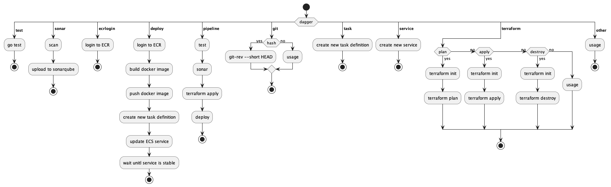

# Dagger CI Tool

## TODO:

- [X] add github actions
- [X] sonarqube
- [X] add diagram
- [ ] add to readme
- [ ] document code



Dagger CI Tool

Provide a task to run

options:
test					Run go test
sonar					Scan with SonarQube and upload to project
ecrlogin				Login to AWS ECR
deploy					Will run everything needed to Deploy to AWS ECS
pipeline				Will run test, terraform apply, build, and deploy 
git [ hash ] 				Git short hash, git rev-parse HEAD
task [ name ]				Create/update task definition on AWS ECS
service [ name ]			Create service on AWS ECS
terraform [ plan | apply | destroy ]	Run Terraform commands
